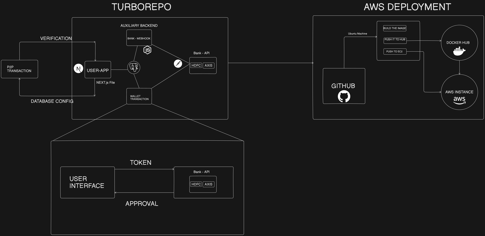

#ZapPay

Welcome to ZapPay!

 Zappay is a modern, scalable, and efficient application designed to handle end-to-end financial transactions securely. Built with cutting-edge technologies, it ensures a seamless user experience, robust data management, and high performance.

- Features :

- End-to-End Transactions: Secure and reliable handling of payments and transfers.
- Real-Time Updates: Live status tracking for transactions using server-rendered updates.
- Scalability: Monorepo setup for shared codebase and efficient project management.
- Responsive Design: Fully responsive UI powered by Tailwind CSS for an optimized experience across devices.
- Robust Database Management: Postgres database integration for reliable data storage and Prisma ORM for efficient queries and migrations.



## Deployment

- CI/CD Pipeline 

DOCKER HUB.

AWS.
## Tech Stack


- Frontend & Backend
Next.js: Full-stack framework for server-rendered and static page generation.

Express.js: Auxiliary backend services for additional API routes.
- Tooling
Turborepo: Monorepo for better organization, development workflow, and code sharing.
- Database
PostgreSQL: A scalable and secure relational database.

Prisma ORM: Type-safe queries, migrations, and database management.
- Styling
Tailwind CSS: Utility-first CSS framework for a modern and clean design
## Run Locally

Clone the project

```bash
  git clone https://link-to-project
```

Go to the project directory

```bash
  npm install in root directory

```
Run User-app
```bash
   cd apps/user-apps
```


```bash
  npm install
```
Run Bank-Webhook 
```bash
 cd apps/bank-webhook
```

```bash
  npm install
```


Start the server

```bash
  npm run dev in both user-app and bank-webhook app
```


